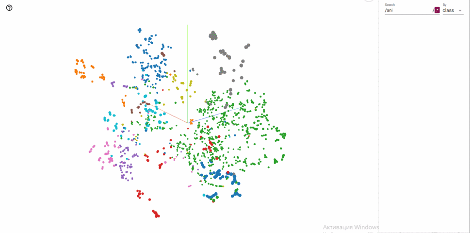

# BirdEmbedSupConLoss

Warning: Most of the code requires refactoring.

This is a project for a Deep Learning Course. The project implements a TDCN++ sound separation model and a TDCN++ based embedding model trained using Supervised Contrastive Loss. The training data consisted of the Kaggle 2022 + 2023 training dataset, and the testing data was derived from the Hawaii soundscape recordings dataset.

- `main.py` contains the TDCN++ separation training with the corresponding trainer `trainer_separation.py`.

- `main_embed_only.py` contains the training for the embedding model, with the trainer being `trainer_new_contrast.py`.

- `main_embed_cl.py` contains the training for the embedding classifier, with the trainer being `trainer_embed_cl.py`.

- `loss.py` includes the metrics and loss functions used in the project.

- `config.py` features a class for configuration settings.

- `coder.py` is responsible for converting labels to numbers.

- `embed_models.py` hosts the embedding models, with EmbeddingTDCNpp5 being the correct implementation.

- `dataset.py` includes PyTorch dataset implementations.

- `clean_test_new.ipynb` demonstrates an example of inference on Hawaii data. The Hawaii labels were transformed from strong to weak.

- `tdcnpp.py` is the file containing the implementation of TDCN++.

- `checkpoints_TDCNpp_binary_data_4` is TDCN++ checkpoint folder
- `checkpoints_embednet_only_1024_0.0001_new_loss_new_model_5s_alignedSimCLR_less_f_o` is embedding model checkpoint folder
- `checkpoints_embed_cl_1024_0.0001_2_layers_BCE_5s_last_nohierch_2022_2` is classifier checkpoint folder

